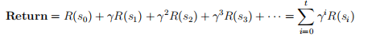
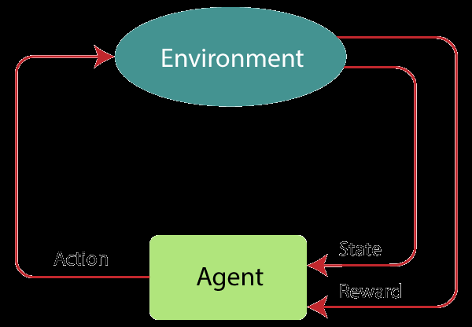
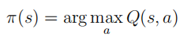
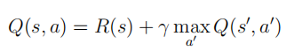
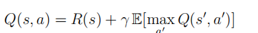
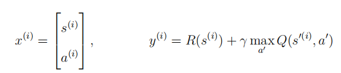
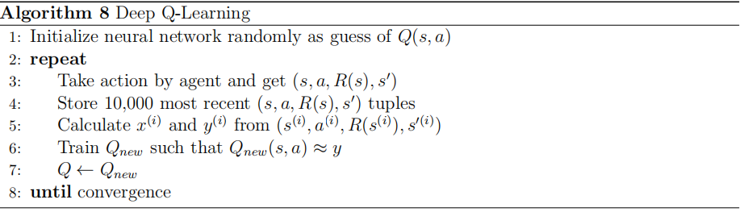

# Reinforcement Learning
The idea of reinforcement learning is the same idea as training a dog: by a reward system. You reward the dog (called agent) when it behaves well (positive action) and you punish
it when it does something wrong (negative action). In more technical words, Reinforcement
Learning is a feedback-based Machine learning technique in which an agent learns to behave
in an environment by performing the actions and seeing the results of actions. Reinforcement
Learning has a lot of applications like controlling robots, factory optimization, financial (stock)
trading, and playing games (including video games).

## Return, Policy, and Markov Decision Process
A reinforcement learning model consists of a number of states. An agent can only be in one
state (s) at a time. Then it can take some action that bring it to another state (s
′
). Each
state is associated with a number called reward denoted by R(s). Some states are defined to
be terminal states in which the agent will stop at the end. Suppose the agent starts from
state s0 and goes through states s1, S2, and so on (until a terminal state). Then the return is
calculated as follows:

where t is the terminal state and γ is the discount factor and is used to make the agent
impatient (to make it prefer a sooner smaller reward to a later larger reward).
In order to make a decision in each state, we define policy which is a function π(s) = a
mapping from states to actions, that tells us what action a to take in a given state s. The goal
of a reinforcement learning model is to find a policy π that tells you what action to take in
every state so as to maximize the return.

### Markov’s Decision Process (MDP)
Markov’s Decision Process is a Reinforcement Learning policy used to map a current state to an
action where the agent continuously interacts with the environment to produce new solutions
and receive rewards. Markov’s Process states that the future is independent of the past, given
the present. This means that, given the present state, the next state can be predicted easily,
without the need for the previous state.

## State-Action Value Function (Q-Function)
There’s a key quantity that reinforcement learning algorithms try to compute which is called
the state-action value function. We denote this function by Q(s, a) and is defined as the return
if you start in state s, take action a once, and then behave optimally after that till
you get to a terminal state. If you have a way to compute Q(s, a) for every state, then all you
need to do in a given state s is to choose an action a that maximizes the Q(s, a). This means
that given the Q-Function, our policy is defined as:

There is a key equation in reinforcement learning that helps us to compute the Q-function
called Bellman equation. If s and a are current state and action, s
′
is the state you get
to after taking action a, and a
′
is the action you take in state s
′
, then the Bellman equation
expresses that:

In stochastic (random) environments, the goal is to maximize the expected return and the
Bellman equation becomes

## Deep Q-Learning for Continuous State Spaces

In real-life situations, the states are in continuous spaces. For example, the state of a moving
particle (like a helicopter) is defined as its position in space (x, y, z) and its instantaneous speed
( ˙x, ˙y, z˙). The idea here to calculate Q(s, a) is to use a neural network that gets s and a as an
input vector x=(s,a) and outputs Q(s, a). This method is called Deep Q-Network (DQN)

In order to train this neural network, we need training examples (x
(i)
, y(i)
). We let the agent
take action and get feedback each time, Thus in each trial, we get a tuple (s
(i)
, a(i)
, R(s
(i)
), s′(i)
)
from which we can calculate x
(i) and y
(i) using Bellman equation:

You may wonder how is it possible to use the Q-Function during the training process. The
answer is that at first, we don’t know what is Q(s, a). So we initialize the neural network
randomly as a guess. The training process algorithm is given here:

You may have noticed that in line 3 of the above algorithm, we have to take action while
still learning. We can take actions randomly which turns out to be not a good idea. We can
also pick the action a that maximizes Q(s, a). There is another way to choose actions that
turns out to be very effective called ϵ-greedy policy. In this method, we have two concepts
Exploitation and Exploration. In each state, we choose one of the following ways:

• Exploitation: With probability of 1 − ϵ, pick the action a that maximizes Q(s, a
)

• Exploration: With probability of ϵ, pick an action a randomly

This random action picking helps to solve the problems occurring in the random initialization
of the neural network. Since the Q-Function gets better and better during the training process,
it is common to start with a high ϵ and then gradually decrease it. This makes our model
choose more random actions at first when the Q-function is not as accurate.

### Improved Neural Network Architecture

You may have noticed that in order to find maxa Q(s, a) we have to run the inference n times (n
is the number of actions) for each action and then find the maximum case. In order to fix that
problem, we can change the architecture of our network to get only s as input and output n
numbers as Q(s, a1), Q(s, a2), . . . , Q(s, an). This improvement will result in much more efficient
inference.

### Limitations of Reinforcement Learning
Reinforcement learning has an exciting research direction with potential for future application,
but at the moment it has some limitations. For instance, it is much easier to get it to work in
a simulation environment than a real robot and it also has fewer applications than supervised
and unsupervised learning

## What is the need for Experience replay/ replay?
Before explaining this, we need to understand what is catastrophic forgetting

### Catastrophic forgetting

So, if we go by the default method of training reinforcement learning agents i.e updating the neural network after each action is taken (1 sample at a time), for complex environments (like open-ai environments), leads to catastrophic forgetting i.e. the model may get confused and start taking the same action for similar looking states. So, if in the previous step for state S, action A yielded high rewards, and now we are at state S1 very similar (but not the same) to S, but taking action A yields the worst rewards, the model gets confused.

To counter this, Experience Replay comes into the picture

Implement batch updates rather than single updates.
Update the model with a mix of new and old memories i.e. retraining/replaying old samples alongside new samples while training the agent
That is why we are using a Deque. So if you observe the logic,

The Deque length(2000) is big compared to the batch(200) we are training the model on.
Hence, for every epoch, after the deque reaches length=2000, new memories are pushed in and the older ones are popped out (as Queues work on the principle of FIFO i.e. First In First Out)
Hence, the deque maintains a mix of old and new memories.